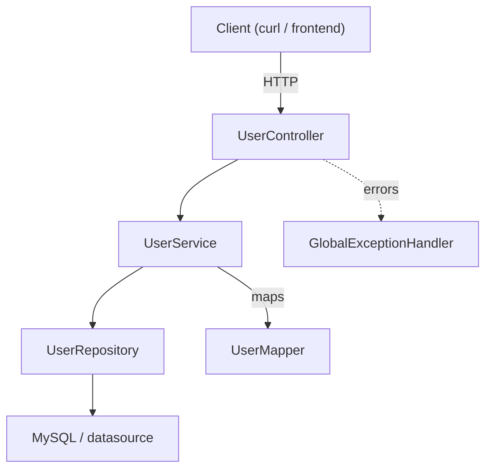

# Identity Stack 

A minimal Spring Boot service providing user CRUD with search, pagination and validation.

Quick start

1) Configure DB in `src/main/resources/application.properties` or via env vars (MySQL example provided).

2) Build and run (PowerShell):

```powershell
.\mvnw.cmd clean package
.\mvnw.cmd spring-boot:run
```

Or run the jar:

```powershell
java -jar target\identity-stack-*.jar
```

HTTP API (base: /api/v1/users)

- POST /api/v1/users — create user (JSON: `UserRequestDto`)
- GET /api/v1/users — list users (optional: `q`, `page`, `size`, `sort`)
- GET /api/v1/users/{id} — get user
- PATCH /api/v1/users/{id} — partial update
- DELETE /api/v1/users/{id} — delete user

Architecture



Error responses
- Validation and business errors return `ExceptionResponseDto` (HTTP status + messages). See `GlobalExceptionHandler`.

Files of interest
- `controller/UserController.java`
- `service/UserService.java`
- `repository/UserRepository.java`
- `entity/User.java`, `mapper/UserMapper.java`, `dto/**`, `exception/**`

Notes
- Uses Spring Data JPA. Default `spring.jpa.hibernate.ddl-auto=update` is set for development.


Contribute

- Fork → branch → PR. Open issues for feature requests or bugs.


