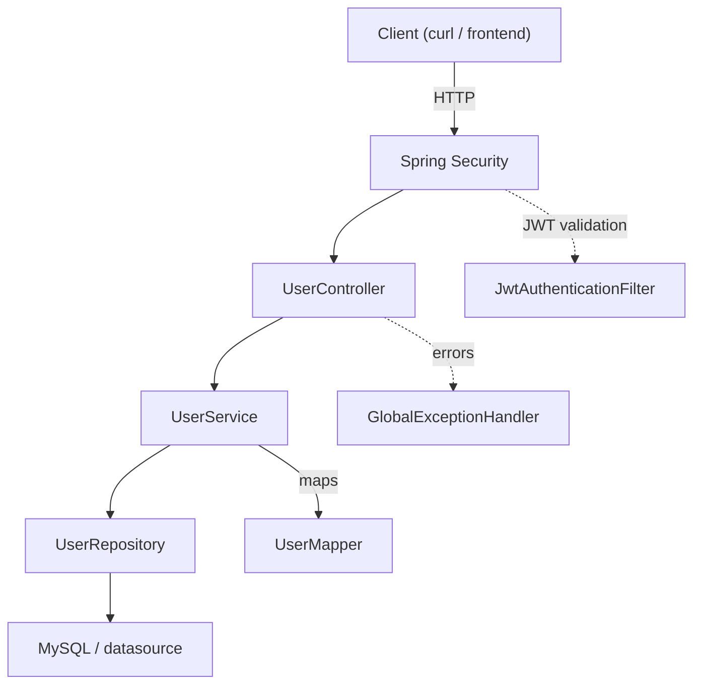

# Identity Stack

A minimal Spring Boot service providing user management with CRUD operations, search, pagination, validation, JWT-based authentication, token invalidation, and role-based access control.

## Table of Contents

- [Identity Stack](#identity-stack)
  - [Table of Contents](#table-of-contents)
  - [Tech Stack](#tech-stack)
  - [Architecture](#architecture)
  - [Quick Start](#quick-start)
    - [Option A: Run Locally](#option-a-run-locally)
    - [Option B: Run with Docker](#option-b-run-with-docker)
  - [API Reference](#api-reference)
    - [Authentication](#authentication)
    - [Users](#users)
    - [Admin](#admin)
  - [Access Control](#access-control)
  - [Anonymous User Workflow](#anonymous-user-workflow)
  - [Authentication \& Security](#authentication--security)
  - [Search, Pagination \& Sorting](#search-pagination--sorting)
  - [Configuration](#configuration)
    - [Database](#database)
    - [Admin Bootstrapping](#admin-bootstrapping)
  - [Docker Services](#docker-services)
    - [Environment Variables](#environment-variables)
  - [Error Responses](#error-responses)
  - [Files of Interest](#files-of-interest)
  - [Contribute](#contribute)


## Tech Stack

* **Language:** Java 21
* **Framework:** Spring Boot
* **Security:** Spring Security, JWT (JSON Web Tokens)
* **Database:** MySQL
* **ORM:** Spring Data JPA (Hibernate)
* **Build Tool:** Maven
* **Containerization:** Docker, Docker Compose
  


## Architecture




## Quick Start

### Option A: Run Locally

1. Configure the database and application settings in `src/main/resources/application.properties` or through environment variables. A MySQL configuration example is provided.

2. Build and run the application (PowerShell):

```powershell
.\mvnw.cmd clean package
.\mvnw.cmd spring-boot:run
```

Or run the packaged JAR:

```powershell
java -jar target\identity-stack-*.jar
```

### Option B: Run with Docker

1. Copy the environment template to create your local configuration:

```powershell
Copy-Item .env.example .env
```

2. Set your own values for `DB_USERNAME`, `DB_PASSWORD`, and `MYSQL_ROOT_PASSWORD` in the `.env` file.

3. Build and start the containers:

```powershell
docker compose up --build
```

4. The application will be available at `http://localhost:8080` once the MySQL healthcheck passes.

To stop the containers:

```powershell
docker compose down
```

To stop the containers and remove persisted database data:

```powershell
docker compose down -v
```

## API Reference

Base URL: `/api/v1`

### Authentication

* `POST /api/v1/auth/login` — authenticate a user and receive a JWT access token.

### Users

* `POST /api/v1/users` — create a user (JSON: `UserRequestDto`)
* `GET /api/v1/users` — list users (optional: `q`, `page`, `size`, `sort`)
* `GET /api/v1/users/{id}` — get a user by ID
* `PATCH /api/v1/users/{id}` — partially update a user
* `DELETE /api/v1/users/{id}` — delete a user

### Admin

Admin-only operations are exposed under `/api/v1/admin/users/**` and require the `ADMIN` role.

These endpoints are protected using Spring Security method-level authorization.

## Access Control

| Method | Endpoint                 | Access                |
| ------ | ------------------------ | --------------------- |
| POST   | `/api/v1/auth/login`     | Public                |
| POST   | `/api/v1/users`          | Public                |
| GET    | `/api/v1/users`          | JWT required          |
| GET    | `/api/v1/users/{id}`     | JWT required          |
| PATCH  | `/api/v1/users/{id}`     | JWT required          |
| DELETE | `/api/v1/users/{id}`     | JWT required          |
| *      | `/api/v1/admin/users/**` | `ADMIN` role required |

Protected endpoints require a valid Bearer token:

```http
Authorization: Bearer <access-token>
```

## Anonymous User Workflow

Users without a valid JWT (anonymous/unauthenticated users) can access only the public endpoints.

1. **Registration** — An anonymous user sends a `POST` request to `/api/v1/users` with the required user details (`UserRequestDto`). The password is hashed using BCrypt before being persisted.
2. **Login** — The user sends a `POST` request to `/api/v1/auth/login` with their credentials. On successful authentication, the server issues a JWT access token containing the user's ID, role, and token version.
3. **Accessing Protected Resources** — The client includes the issued token in the `Authorization` header (`Bearer <access-token>`) for all subsequent requests to protected endpoints.
4. **Unauthorized Access** — Any request to a protected endpoint without a valid token, or with an expired/invalidated token, is rejected by `JwtAuthenticationFilter` with a `401 Unauthorized` response.

Once authenticated, the user transitions from an anonymous client to an authorized client, gaining access to endpoints permitted by their assigned role (`USER` or `ADMIN`).

## Authentication & Security

The application uses stateless JWT-based authentication with Spring Security.

* Username-based authentication using `CustomUserDetailsService` and `CustomUserDetails`.
* Passwords are hashed using BCrypt before being stored.
* `POST /api/v1/auth/login` authenticates the user and returns a JWT access token.
* `JwtAuthenticationFilter` extracts and validates the user ID and token version from incoming Bearer tokens.
* JWTs contain the subject, issuer, expiration time, user role, and token version.
* Access tokens are valid for 10 minutes (`600000` ms), configurable via the `TOKEN_EXPIRATION` environment variable.
* Token versioning allows the server to invalidate previously issued tokens. The token version in the JWT must match the version stored for the user.
* When a token version does not match, the token is rejected and the client must authenticate again.
* Sessions are disabled in favor of stateless authentication.
* Invalid, expired, or invalidated JWTs return `401 Unauthorized`.
* Authentication, JWT, validation, conflict, and not-found errors are handled centrally.
* User registration validates username and password requirements.
* Duplicate email and phone numbers are rejected during registration.
* Admin-only resources require the `ADMIN` role through method-level security.
* An initial admin user can be created automatically through `DataInitializer` when no admin user exists.
* Admin credentials can be configured using `application.admin.username`, `application.admin.password`, and `application.admin.first-name`. These should be provided securely in production rather than committed to source control.


## Search, Pagination & Sorting

The user listing endpoint supports:

* Search using `q`
* Pagination using `page` and `size`
* Sorting using `sort`

Supported sorting fields:

* `firstName`
* `lastName`
* `phone`
* `email`

Example:

```text
GET /api/v1/users?q=ank&page=0&size=20&sort=firstName
```

## Configuration

The application supports configuration through `application.properties` or environment variables.

### Database

The application uses Spring Data JPA with MySQL.

For development, the default Hibernate configuration is:

```properties
spring.jpa.hibernate.ddl-auto=update
```

For production environments, a proper database migration strategy such as Flyway or Liquibase is recommended instead of relying on `ddl-auto=update`.

### Admin Bootstrapping

An initial admin user can be created automatically through `DataInitializer` when no admin user exists. Admin credentials are configured using:

```properties
application.admin.username=admin
application.admin.password=change-me
application.admin.first-name=Admin
```

## Docker Services

The application is containerized using Docker and orchestrated with Docker Compose.

* **app** — builds the Spring Boot application from the local `Dockerfile` and exposes it on port `8080`. It depends on the `mysql` service being healthy before starting.
* **mysql** — runs a MySQL container, initializes the `identitystack` database, and persists data using a named volume (`mysql_data`).


### Environment Variables

Database credentials are not hardcoded and are supplied through environment variables at runtime:

| Variable              | Description                          |
| ---------------------- | ------------------------------------ |
| `DB_USERNAME`          | Username for the application database connection |
| `DB_PASSWORD`          | Password for the application database connection |
| `MYSQL_ROOT_PASSWORD`  | Root password for the MySQL container |

These values are defined in a local `.env` file, which is excluded from version control via `.gitignore`. An `.env.example` file is provided as a reference template for required variables.


## Error Responses

Validation, authentication, JWT, business, conflict, and not-found errors are returned through the application's centralized exception handling.

The standard error response is represented by `ExceptionResponseDto`, containing the HTTP status and relevant error messages.

Invalid, expired, or invalidated JWTs return `401 Unauthorized`.

See `GlobalExceptionHandler` and the security exception handling for implementation details.

## Files of Interest

* `controller/UserController.java`
* `service/UserService.java`
* `repository/UserRepository.java`
* `entity/User.java`
* `mapper/UserMapper.java`
* `dto/**`
* `exception/**`
* `security/**`
* `config/SecurityConfig.java`
* `DataInitializer`


## Contribute

* Fork the repository.
* Create a feature branch.
* Make your changes.
* Open a pull request.

Bug reports and feature requests are welcome through issues.
