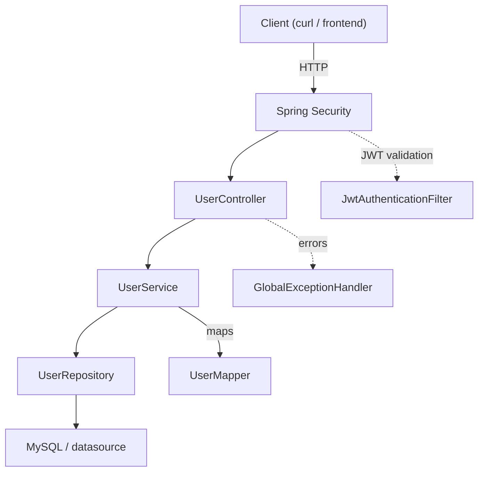

# Identity Stack

A minimal Spring Boot service providing user management with CRUD operations, search, pagination, validation, and JWT-based authentication.

## Quick Start

1. Configure the database in `src/main/resources/application.properties` or through environment variables. A MySQL configuration example is provided.

2. Build and run the application (PowerShell):

```powershell
.\mvnw.cmd clean package
.\mvnw.cmd spring-boot:run
```

Or run the packaged JAR:

```powershell
java -jar target\identity-stack-*.jar
```

## HTTP API

Base URL: `/api/v1`

### Authentication

- `POST /api/v1/auth/login` — authenticate a user and receive a JWT access token.

### Users

- `POST /api/v1/users` — create a user (JSON: `UserRequestDto`)
- `GET /api/v1/users` — list users (optional: `q`, `page`, `size`, `sort`)
- `GET /api/v1/users/{id}` — get a user by ID
- `PATCH /api/v1/users/{id}` — partially update a user
- `DELETE /api/v1/users/{id}` — delete a user

### Access Control

| Method | Endpoint | Access |
|---|---|---|
| POST | `/api/v1/auth/login` | Public |
| POST | `/api/v1/users` | Public |
| GET | `/api/v1/users` | JWT required |
| GET | `/api/v1/users/{id}` | JWT required |
| PATCH | `/api/v1/users/{id}` | JWT required |
| DELETE | `/api/v1/users/{id}` | JWT required |

Protected endpoints require a valid Bearer token:

```http
Authorization: Bearer <access-token>
```

## Authentication & Security

The application uses stateless JWT-based authentication with Spring Security.

- Username-based authentication using `CustomUserDetailsService` and `CustomUserDetails`.
- Passwords are hashed using BCrypt before being stored.
- `POST /api/v1/auth/login` authenticates the user and returns a JWT access token.
- `JwtAuthenticationFilter` validates Bearer tokens on protected requests.
- JWTs contain the subject, issuer, expiration time, and user role.
- Sessions are disabled in favor of stateless authentication.
- Invalid or expired JWTs return `401 Unauthorized`.
- Authentication, JWT, validation, conflict, and not-found errors are handled centrally.
- User registration validates username and password requirements.
- Duplicate email and phone numbers are rejected during registration.

## Search, Pagination & Sorting

The user listing endpoint supports:

- Search using `q`
- Pagination using `page` and `size`
- Sorting using `sort`

Supported sorting fields:

- `firstName`
- `lastName`
- `phone`
- `email`

Example:

```text
GET /api/v1/users?q=ank&page=0&size=20&sort=firstName
```

## Architecture



## Error Responses

Validation, authentication, JWT, business, conflict, and not-found errors are returned through the application's centralized exception handling.

The standard error response is represented by `ExceptionResponseDto`, containing the HTTP status and relevant error messages.

See `GlobalExceptionHandler` and the security exception handling for implementation details.

## Files of Interest

- `controller/UserController.java`
- `service/UserService.java`
- `repository/UserRepository.java`
- `entity/User.java`
- `mapper/UserMapper.java`
- `dto/**`
- `exception/**`
- `security/**`
- `config/SecurityConfig.java`

## Database

The application uses Spring Data JPA with MySQL.

For development, the default Hibernate configuration is:

```properties
spring.jpa.hibernate.ddl-auto=update
```

For production environments, a proper database migration strategy such as Flyway or Liquibase is recommended instead of relying on `ddl-auto=update`.

## Contribute

- Fork the repository.
- Create a feature branch.
- Make your changes.
- Open a pull request.

Bug reports and feature requests are welcome through issues.
